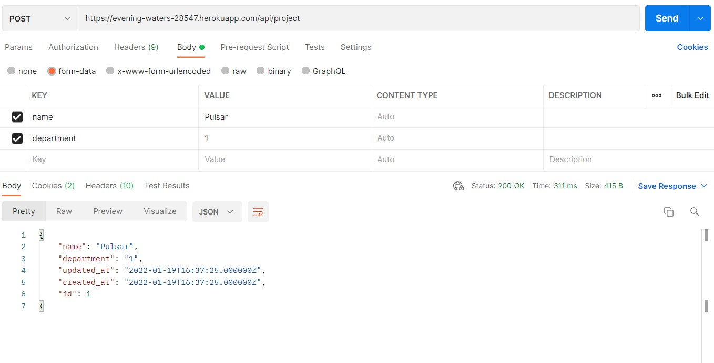
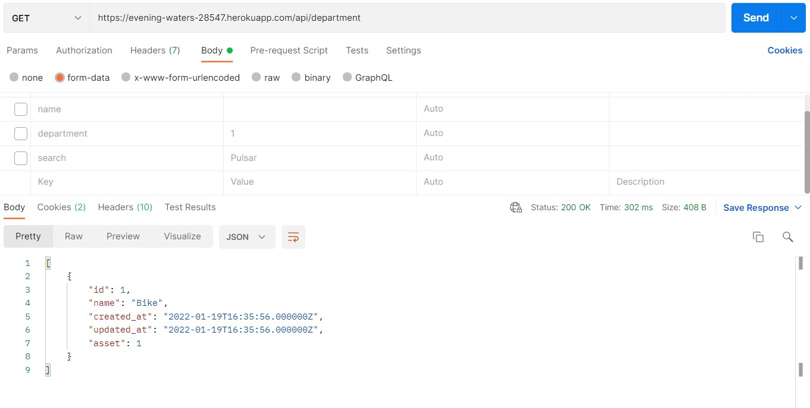
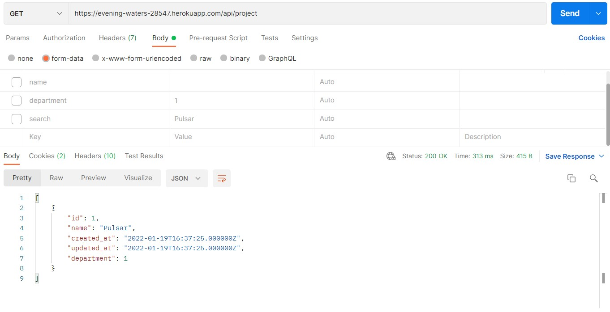

# Assignment-Backend developer

This assignment is regarding implementation of a global search feature.
A custom endpoint is included which is accepting a keyword and giving out the search results
from the entire database.


## API Reference
#### Global Search Feature

```http
  POST https://evening-waters-28547.herokuapp.com/api/search
```

| Parameter | Type     | Description                |
| :-------- | :------- | :------------------------- |
| `search` | `string` | **Required**. keyword that has to be searched in the database |


#### Fill Asset in database

```http
  POST https://evening-waters-28547.herokuapp.com/api/asset
```

| Parameter | Type     | Description                |
| :-------- | :------- | :------------------------- |
| `name` | `string` | **Required**. Name of the asset |


#### Fill Department in database

```http
  POST https://evening-waters-28547.herokuapp.com/api/department
```

| Parameter | Type     | Description                |
| :-------- | :------- | :------------------------- |
| `name` | `string` | **Required**. Name of the department |
| `asset` | `string` | **Required**. id of the asset it is related to |


#### Fill Project in database

```http
  POST https://evening-waters-28547.herokuapp.com/api/project
```

| Parameter | Type     | Description                |
| :-------- | :------- | :------------------------- |
| `name` | `string` | **Required**. Name of the project |
| `department` | `string` | **Required**. id of the department it is related to |


#### Get all asset

```http
  GET https://evening-waters-28547.herokuapp.com/api/asset
```
#### Get all department

```http
  GET https://evening-waters-28547.herokuapp.com/api/department
```
#### Get all project

```http
  GET https://evening-waters-28547.herokuapp.com/api/project
```

#### delete an asset

```http
  DELETE https://evening-waters-28547.herokuapp.com/api/asset/${id}
```

| Parameter | Type     | Description                       |
| :-------- | :------- | :-------------------------------- |
| `id`      | `string` | **Required**. Id of asset to delete |

#### delete an department

```http
  DELETE https://evening-waters-28547.herokuapp.com/api/department/${id}
```

| Parameter | Type     | Description                       |
| :-------- | :------- | :-------------------------------- |
| `id`      | `string` | **Required**. Id of department to delete |

#### delete an project

```http
  DELETE https://evening-waters-28547.herokuapp.com/api/project/${id}
```

| Parameter | Type     | Description                       |
| :-------- | :------- | :-------------------------------- |
| `id`      | `string` | **Required**. Id of project to delete |


## Screenshots









